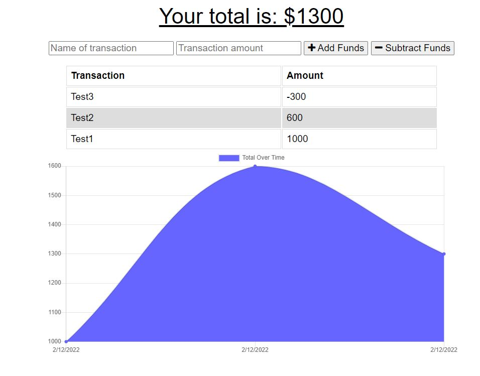

# Budget Tracker

## Description 

An PWA application that allows you to track your budget online and offline! As an users, I want to be able to track my withdrawls and deposits with or without internet connection, so that my account balance is accurate.

Repo: https://github.com/andrewyu22/budget-tracker

Link: https://afternoon-beyond-89263.herokuapp.com/

---
## Table of Contents 

* [Installation](#installation)
* [Usage](#usage)
* [License](#license)
* [Contributing](#contributing)
* [Tests](#tests)
* [Questions](#questions)

---
## Installation

"npm install" to install all dependency

---
## Usage 

Start tracking your budget now!

---
## License

No Licenses for this project!

---
## Contributing

No contribution information for this project!

---
## Tests

No test for this project!

---
## Questions

Link to Github: https://github.com/andrewyu22

If you have any further questions, please contact me at andrewyu2654@gmail.com
